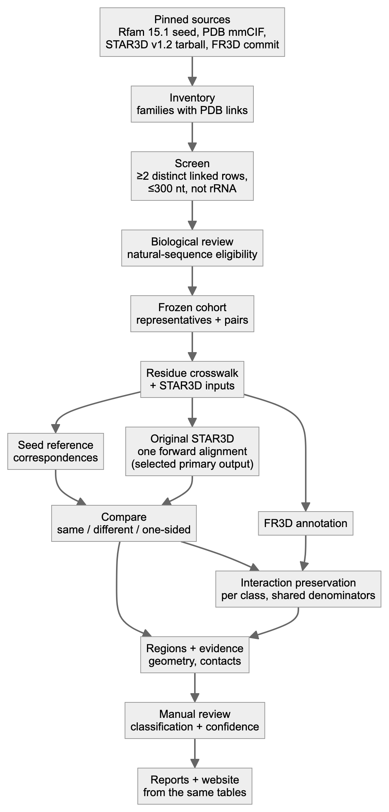
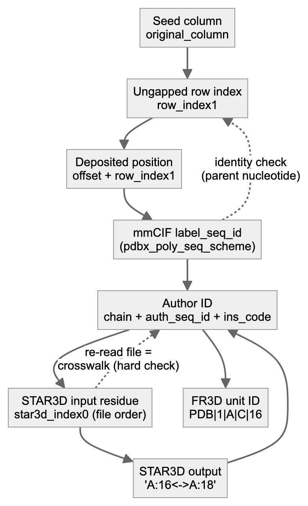
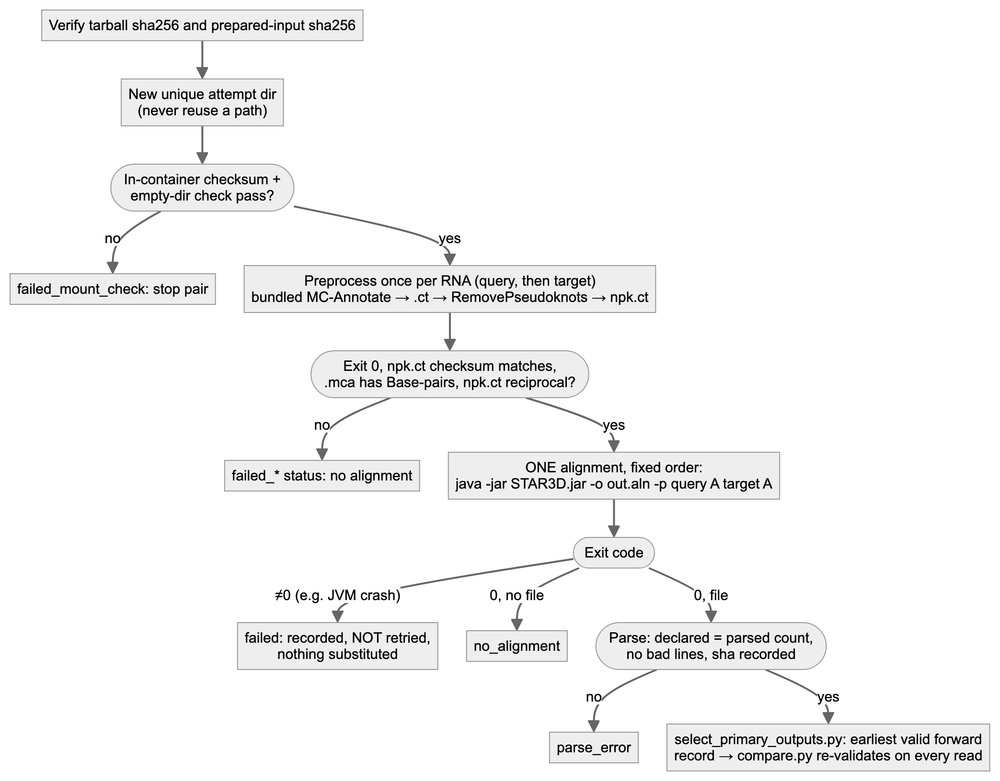
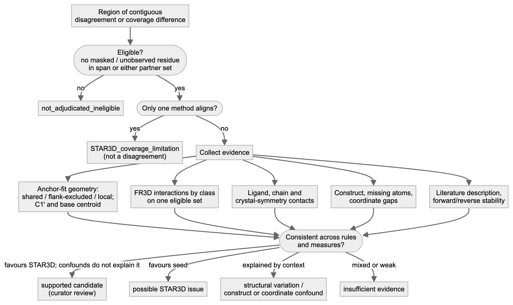
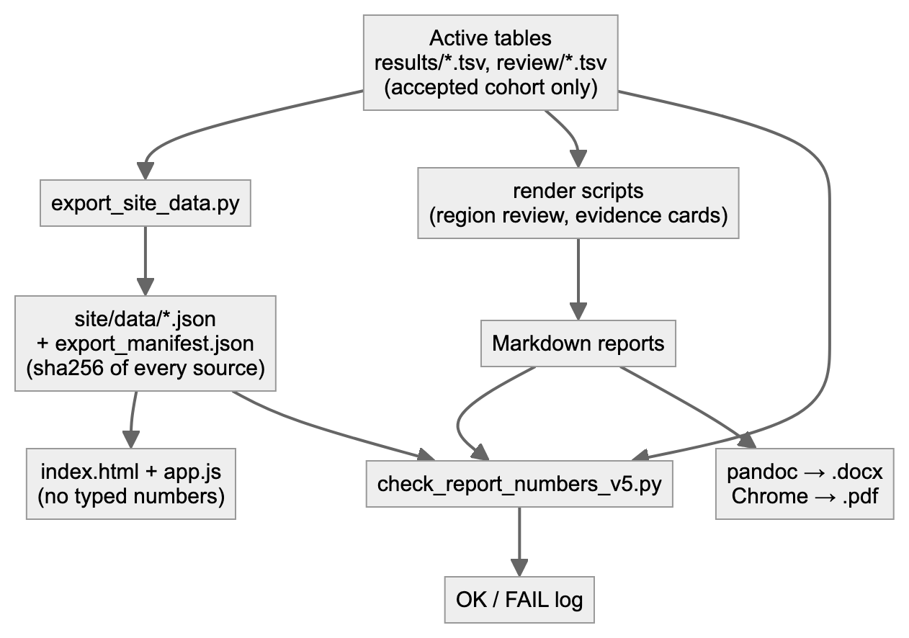
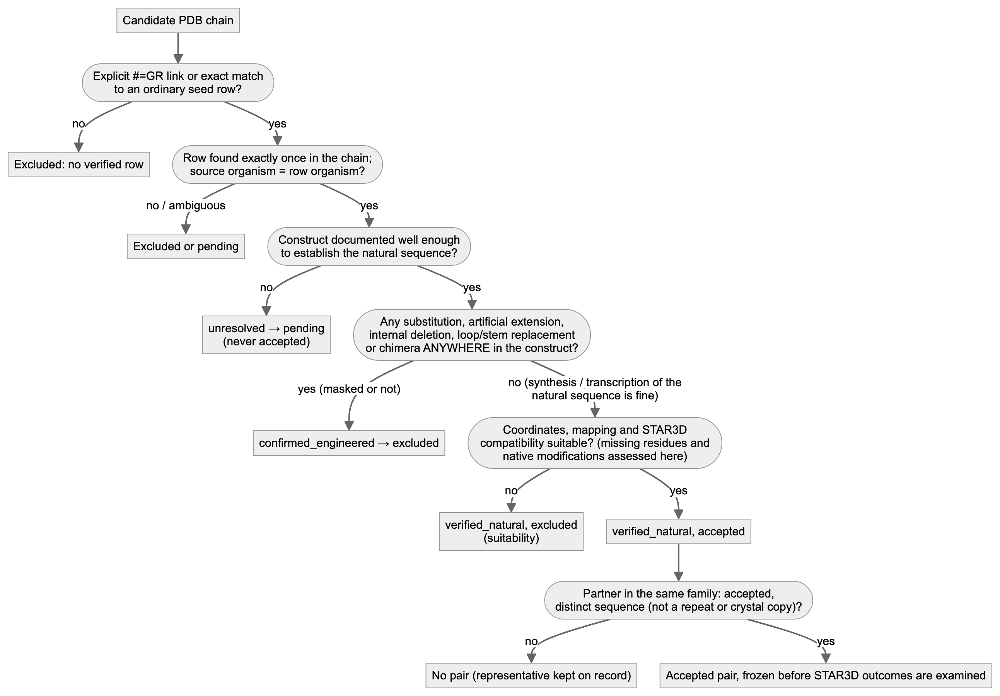
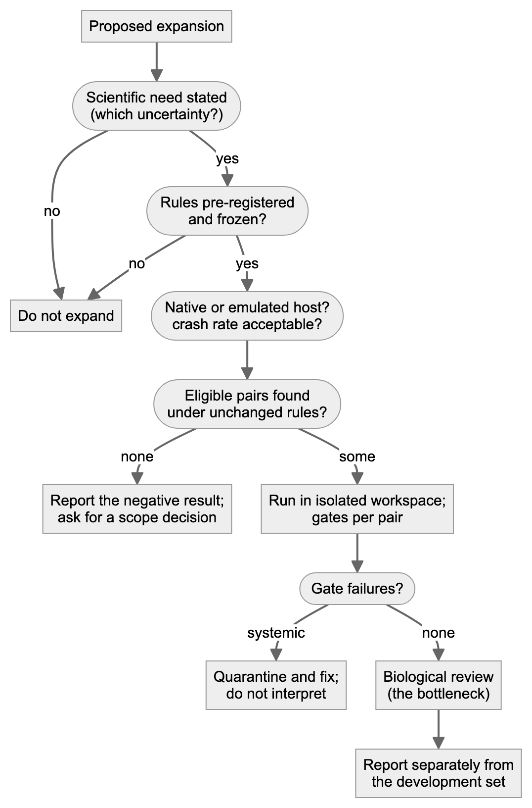

*Written for a PhD student joining the project. Prepared by an AI research agent (Claude) from the repository and its
validated outputs; it has not yet been reviewed by the researcher or the professor. Every path below is relative to
`rfam_star3d_pilot_v2/` unless stated otherwise. Values quoted as results come from the tables named next to them.
Anything not implemented is marked **(planned)**, and commands that were not executed while preparing this guide are
marked **(untested)**.*

> **Method.** For each selected RNA pair, we use one forward alignment from original STAR3D v1.2 with default
> parameters, following the package's preprocessing procedure.
>
> **Dataset policy.** The active analysis includes only experimental structures of verified natural RNA sequences.
> Confirmed engineered constructs and unresolved cases are excluded from the accepted cohort. This is the
> researcher's explicit requirement (v5); earlier versions analysed engineered constructs with masks and ran
> STAR3D in both directions with replicates. Those results are archived and are not used.

# A. Project purpose and boundaries

## A.1 The question

> For distinct homologous RNA sequences with suitable experimental structures, where do ordinary Rfam seed
> correspondences and original STAR3D correspondences differ, and what evidence explains those differences?

Some terms used throughout:

- **RNA family (Rfam).** Rfam groups related RNAs into families such as RF00522 (the preQ1-I riboswitch). For each family
  it publishes a **seed alignment**: a hand-curated multiple sequence alignment in Stockholm format. Each **row** is
  one RNA sequence region (for example `URS00023119CB_2126436/1-34`), and each **column** says which nucleotides of the
  different rows correspond to each other.
- **Correspondence.** A statement that nucleotide *i* of RNA A plays the same role as nucleotide *j* of RNA B. A seed
  alignment implies correspondences: two residues in the same column correspond.
- **STAR3D.** A structural aligner (Ge & Zhang 2015, *NAR* 43:e137). From the 3D coordinates of two RNAs it finds
  conserved helical *stacks*, superimposes them and aligns the loops between them. Its output is a list of
  corresponding nucleotides. We use the **original v1.2 release**, not LocalSTAR3D or CircularSTAR3D.
- **FR3D.** A program that annotates base pairs (for example *cWW*, the canonical cis Watson–Crick pair) and base
  stacking in a 3D structure. We use it to ask whether a correspondence carries interactions over from one structure
  to the other.

## A.2 Why compare Rfam with STAR3D

The long-term motivation is better identification of RNA interactions and motifs, especially non-canonical pairs. If
sequence alignments place nucleotides in the wrong columns, interaction labels transferred through them will be wrong.
Comparing a published sequence alignment with a structure-based one, on RNAs whose structures are known, shows where
the two disagree and why.

## A.3 What counts as an informative result

All of the following are valid results. A region can be classified as:

- a **supported candidate** for Rfam curator review;
- a **STAR3D limitation**, such as short alignments or coordinate-gap artefacts;
- **genuine structural variation**, for example from ligand binding or a bound protein;
- an **experimental construct effect**, for example engineered loops;
- a **mapping or annotation problem**;
- **insufficient evidence**.

Agreement is also informative, and so is a well-documented failure to find eligible data. Neither method is treated as
ground truth.

## A.4 What the project does not (yet) show

- **No sequence-only predictor**, and no general alignment-correction method.
- **No accuracy estimate for Rfam.** The active dataset has 1 family with 3 accepted pairs, so rates cannot be
  extrapolated.
- **No structure-independent baseline.** For every family studied, the "ordinary" seed *is* the 3D-curated alignment
  (section H).

## A.5 Relation to the professor's instructions

The meeting transcript is not in the repository. The professor's requests are taken from the transcript-derived list in
`Phase 1/plans/RNA_Research_Plan_Fresh_Start_2026_10_08 (1).docx`. Each one is traced to code and evidence in
`deliverables/2026-10-09_v4/tables/requirements_matrix.tsv`, which also labels whether an item is a professor
instruction, a later user decision or our own methodological choice. In summary, the professor asked us to:

1. count families with ≥2 eligible distinct sequences;
2. link each chain to its exact seed row;
3. remove redundant and engineered constructs;
4. compare the ordinary and structure-curated seeds;
5. run original STAR3D and study disagreements;
6. if experimental cases cannot be found, bring the search to Smriti and ask about predicted structures.

# B. System architecture

{width=3.8in}

## B.1 Modules

**Shared libraries** used by many modules:

- `scripts/stockholm.py` — the Stockholm parser;
- `scripts/fetch.py` — downloads with a manifest;
- `scripts/locate.py` — maps residues to seed elements.

| Module | Purpose | Inputs | Outputs | Actual script/path | Validation | Dependencies |
|---|---|---|---|---|---|---|
| Source pinning | Download and freeze sources | URLs in `config.yaml` | `inputs/…`; `metadata/sources_manifest.tsv` (URL, time, sha256) | `scripts/fetch.py`, `scripts/inventory.py` | Seed sha256 must equal `config.yaml`; never overwritten | network |
| Inventory and screen | Families with PDB links; ≥2 distinct linked rows; ≤300 nt; not rRNA | `Rfam.seed.gz`, `Rfam.pdb.gz` | `results/family_inventory.tsv`, `metadata/chain_row_candidates.tsv` | `scripts/inventory.py` | Parser gate on a real interleaved record (`parser_gate.py`) | stockholm.py |
| Structure evidence | Link each chain to a seed row; organism; coverage; modifications | mmCIF | `mappings/structure_sequence_map.tsv`, `review/evidence/*.json` | `scripts/structures.py` (`build_link`) | Exact sequence match at row coordinates; parent-mapped modifications | gemmi |
| Provenance and construct review | Source organism, engineering, papers | Papers, NCBI genomes | `review/construct_review.tsv`, `review/exact_source_check.tsv` | `literature.py`, `exact_source_check.py`, `blast_*.py` + manual review | Genome search on both strands | NCBI, Europe PMC |
| Natural-sequence eligibility (v5) | Decide verified_natural / confirmed_engineered / unresolved and accepted / excluded / pending for every chain | evidence above | `review/natural_sequence_eligibility.tsv`, `results/dataset_chains.tsv` | manual decisions + `scripts/natural_policy.py` | Engineered or unresolved can never be accepted; masking irrelevant; tests | — |
| Cohort freeze | Accepted representatives and pairs, fixed before any outcome is examined | eligibility table | `results/selected_representatives.tsv`, `results/selected_pairs.tsv`, `metadata/cohort_v2.0_natural_freeze.json` | `scripts/natural_policy.py rebuild-cohort` | A pair needs two accepted, distinct representatives; sha256 freeze | — |
| Crosswalk and STAR3D inputs | Residue identity across numbering systems; legacy PDB input | mmCIF, seed | `results/residue_crosswalk.tsv`, `runs/_inputs/*.pdb`, `mappings/aligner_inputs.tsv` | `scripts/prepare_inputs.py` | Re-reads the written file exactly as STAR3D does; identity check per residue | gemmi |
| Seed reference | Seed correspondences per pair | seed, crosswalk | `results/reference_pairs.tsv`, `standard_seed_membership.tsv`, `standard_seed_rows.sto` | `scripts/reference.py` | Raw-line trace + sha256 of every row; valid per-family Stockholm | — |
| Original STAR3D | ONE forward alignment per pair (Preprocess once per RNA) | PDB inputs, tarball | `runs/<pair>/attemptN/…/*.aln`, `results/run_manifest.tsv` | `scripts/star3d.py run <PAIR>` | Unique attempt dirs, in-container checksums, preprocessing-content gate; no retry | docker image `star3d-runtime:1` |
| Primary output selection | Choose the one original output per pair | run manifest, prepared inputs | `results/primary_star3d_outputs.tsv` | `scripts/select_primary_outputs.py` | Earliest valid forward record; input/preprocessing/output/crosswalk checks; never reverse or later replicate | star3d.py, compare.py |
| Comparison | Same / different / one-sided partner per residue | selected `.aln`, reference | `results/correspondence_comparison.tsv`, `pair_summary.tsv` | `scripts/compare.py` | Re-validates the stored output (counts, sha, injectivity); atomic writes | star3d.py |
| Interaction annotation | FR3D pairs and stacks; preservation per class | mmCIF, comparison | `annotations/raw/*`, `results/interaction_comparison.tsv`, `interaction_summary.tsv` | `scripts/interactions.py` | Installed FR3D commit verified; raw-hash cache; symmetry mates excluded; per-comparison denominators | fr3d-python 288f98cc |
| Regions | Group disagreements; eligibility | comparison, interactions | `results/region_review.tsv` | `scripts/regions.py` | Span and partner masks; history kept on change | locate.py |
| Region evidence | Geometry, contacts, interactions per region | all of the above | `results/region_evidence/`, `results/anchor_fit/` | `scripts/region_evidence.py`, `scripts/anchor_fit.py` | Degenerate anchor sets refused | numpy, gemmi |
| Biological review | Classification + confidence | evidence tables, papers | `review/region_review_v4.tsv` → `results/region_review.tsv` | manual + `scripts/apply_region_reviews.py` | Dated; reviewer recorded | — |
| Method audit (historical) | STAR3D pair rule; S1/S2 sensitivity | preprocessing products | `archive/v4_multi_run_history/results/sensitivity/` | `star3d_preproc_audit.py` (active); sensitivity runners archived | Separate namespace; never part of the primary analysis | docker |
| Provenance surveys | Ordinary vs curated seed; release history | Rfam 14.0–15.1 files | `results/seed_collection_comparison/`, `results/rfam_history/` | `scripts/survey_b.py`, `scripts/rfam_history.py` | Byte-level record comparison | — |
| Fresh reproduction | Re-download and rerun selected pairs | URLs | `audit/fresh_repro*/` | `scripts/fresh_repro.py --pairs …` | Input gate stops on any mismatch | docker, FR3D |
| Prospective expansion (pattern) | Pre-registered new pairs in an isolated workspace | screened candidates | `expansion_v4/` (archived: tRNA pair excluded in v5) | `scripts/expansion_v4.py freeze / run` | Freeze hashes re-checked before run | all stages |
| Derived alignment view | Gapped display of seed and STAR3D correspondences (SQARMA visualisation, not STAR3D output) | comparison, crosswalk | `results/derived_alignment_views.md/.tsv` | `scripts/derived_alignment_view.py` | Self-check re-derives every correspondence; no invented matches | — |
| Reports and website | Human-readable outputs from the same tables | active tables | `reports/`, `deliverables/2026-10-09_v5/`, `deliverables/2026-10-09_v5/site/` | `export_site_data.py`, `evidence_cards.py`, render scripts | `check_report_numbers_v5.py`; HTTP checks | pandoc, Chrome (docs) |
| Tests and manifests | Regression tests; checksums | code | `tests/` (81), `MANIFEST.tsv`, repro package | pytest; mutation check | 18/18 re-introduced defects detected | pytest |

## B.2 Stage order and parallelism

**The required order is:**

1. Inventory, then structures, then review, then cohort freeze.
2. `prepare_inputs.py` (crosswalk), then `reference.py`. The reference stage needs the crosswalk; running it first
   gives zero assessable pairs, which happened once in v4 and was caught.
3. `star3d.py`, only for pairs without a valid existing output, then `select_primary_outputs.py`.
4. `compare.py`, then `interactions.py`, then `regions.py`.
5. Region evidence, then review, then reports.

**What can run in parallel:**

- Downloads, literature retrieval and genome checks for different structures.
- STAR3D runs for different pairs. Each uses its own attempt directory. On the emulated host we ran them one at a time.
- FR3D annotation of different structures.
- Report rendering, after the tables are final.

The global table stages (`reference`, `compare`, `interactions`) refuse subset runs. They always rewrite the complete
table, so a partial rerun cannot silently replace complete results.

# C. Step-by-step real example: 6VUI–7REX (RF00522, preQ1-I riboswitch)

All values below are copied from validated tables. The pair is *Thermoanaerobacter tengcongensis* (PDB 6VUI, chain A)
versus *Carnobacterium antarcticum* (PDB 7REX, chain A).

**Step 1: family and seed rows.** Both chains carry explicit structure links in the pinned `Rfam.seed.gz` 15.1, as
`#=GR` lines `6VUI_A_SS` and `7REX_A_SS`. The rows are:

- 6VUI → `URS000080E32E_119072/1-33`;
- 7REX → `URS00023119CB_2126436/1-34`.

Membership is proven by the raw decompressed line numbers and the sha256 of each aligned string
(`results/standard_seed_membership.tsv`).

**Step 2: structure and construct verification.**

- Both are X-ray structures (2.68 Å and 2.6 Å).
- Each deposited sequence equals the row sequence over the family interval.
- There are no modified nucleotides.
- Each sequence was found exactly in its claimed source genome: AE008691.1 on the minus strand at 1523221 for 6VUI, and
  CP010796 on the plus strand at 2093557 for 7REX (`review/exact_source_check.tsv`). An exact genome match supports
  sequence provenance, but does not prove every step of how the experimental construct was prepared.

**Step 3: a real crosswalk excerpt** (`results/residue_crosswalk.tsv`):

| rep | row index | nt | seed column | label_seq_id | auth ID | STAR3D index | STAR3D residue |
|---|---|---|---|---|---|---|---|
| 6VUI_A | 1 | C | 6 | 1 | A:1 | 0 | A:1 |
| 6VUI_A | 16 | C | 27 | 16 | A:16 | 15 | A:16 |
| 7REX_A | 16 | U | 26 | 16 | A:16 | 15 | A:16 |
| 7REX_A | 17 | C | 27 | 17 | A:17 | 16 | A:17 |
| 7REX_A | 18 | C | 28 | 18 | A:18 | 17 | A:18 |

{width=3.9in}

**Step 4: the Rfam correspondence.** 6VUI C16 sits in seed column 27. In the 7REX row, column 27 holds C17. So the seed
says 6VUI C16 ↔ 7REX C17.

**Step 5: STAR3D input and commands** (the package README's procedure; one forward alignment). `prepare_inputs.py` writes `runs/_inputs/6vuia.pdb` and
`runs/_inputs/7rexa.pdb` (model 1, first altloc, author numbering). Inside a fresh attempt directory, in the container,
the wrapper runs:

```
java -cp STAR3D.jar Preprocess 6vuia A
java -cp STAR3D.jar Preprocess 7rexa A
java -jar STAR3D.jar -o out/RF00522__6VUI_A__7REX_A__a1__forward__rep1.aln -p 6vuia A 7rexa A
```

This file, `runs/RF00522__6VUI_A__7REX_A/attempt1/STAR3D_source/out/RF00522__6VUI_A__7REX_A__a1__forward__rep1.aln`,
is the pair's selected primary output (`results/primary_star3d_outputs.tsv`). It is reused byte-for-byte. Its name
still contains "rep1" because it was written before the single-run policy; it was not rerun just to rename it.

The defaults recorded in the output are: RMSD cutoff 4.0 Å, minimum stack 3, gap open −5, gap extension −2, match 3,
mismatch 0.

{width=6.2in}

**Step 6: parsed STAR3D correspondence.** The `.aln` file reports `#Aligned nucleotide: 32` and
`#Alignment RMSD: 2.34A`, followed by mapping lines including:

```
A:5<->A:5
A:16<->A:18
A:24<->A:25
```

So STAR3D says 6VUI C16 ↔ 7REX C18. `compare.py` translates both sides through the crosswalk and labels each source
residue (`results/correspondence_comparison.tsv`, the selected output):

- **Agreement example:** 6VUI C1 → seed 1, STAR3D 1, labelled `same_partner`.
- **Disagreement example:** 6VUI C16 → seed 17, STAR3D 18, labelled `different_partner`.
- **One-sided cases:** 6VUI A13 is `star3d_only` (the seed leaves it opposite a gap); 6VUI A23 is `rfam_only`.

Pair totals: 16 same, 15 different, 1 seed-only and 1 STAR3D-only, out of 32 structurally assessable seed pairs.

**Step 7: interaction annotation and eligibility.**

- FR3D annotates 6VUI G5–C16 as cWW.
- Mapped through each method, it becomes 7REX G5–C17 under the seed, for which FR3D reports no annotation
  (`no_annotated_target_pair`), and G5–C18 under STAR3D, which is cWW (`exact_class_preserved`)
  (`results/interaction_comparison.tsv`).
- The interaction is **eligible** for the seed-vs-STAR3D comparison because:
  - both source residues are unmasked and observed;
  - both methods map both endpoints;
  - all targets are observed and unmasked.

**Step 8: a worked interaction count.** On the eligible set for 6VUI→7REX:

- the seed preserves 19 of 47 interactions and STAR3D 29 of 47 (`results/interaction_summary.tsv`);
- for canonical pairs alone, the seed preserves 0 of 7 and STAR3D 5 of 7.

Two caveats apply. First, the denominator is the same set for both methods; a method that maps fewer residues is not
rewarded with a smaller denominator. Second, target-RNA interactions are evaluated through the same mapping inverted,
which is not another STAR3D run, and have their own denominator.

**Step 9: interpreting the disagreement region.** `regions.py` groups 6VUI 7–23 into one region.
`region_evidence.py` then superposes the two structures on the residues where both methods agree. The anchor sets are
all shared residues, shared residues minus the flanks, and local shared residues only. It then measures C1′ and
base-centroid distances to each method's partner.

- **P1 3′ strand (14–21).** The STAR3D partners are 0.5–3.3 Å away and the seed partners 3.6–8.8 Å, under every rule.
  The 7REX authors describe P1 with a G5–C18 pair.
- **Loop L1 (7–12).** The seed is better supported.
- **Classification.** P1 3′ strand: supported candidate (moderate). L1: possible STAR3D issue (low–moderate)
  (`review/region_review_v4.tsv`).

{width=6.5in}

**Step 10: from tables to report and website.**

- The reports quote the tables. `check_report_numbers_v5.py` re-reads the tables and confirms the numbers.
- `export_site_data.py` copies the same tables into `site/data/*.json`, together with a manifest of source sha256
  values.
- The website types no numbers of its own.

{width=5in}

# D. Data eligibility

{width=6.5in}

Examples from the actual screens:

- **Organism mismatch.** 9J4O (*B. subtilis* tRNA-Leu) was excluded because its exact sequence match is to a seed row
  from *H. halodurans*. An identical sequence does not make that row this RNA's row.
- **Modified nucleotides.** 1EHZ (yeast tRNA-Phe) was excluded because original STAR3D reads modified nucleotides as
  "N".
- **Engineered constructs (v5 policy).** Every construct with introduced substitutions, artificial extensions,
  internal deletions or loop and stem replacements is excluded, even when the altered residues were masked or lie
  outside the extracted interval. Examples: SAM-I 4KQY (GAAA tetraloop), cobalamin 6VMY (5′ "cloning artifact" G) and
  tRNA 5CCB (extra 5′ G).
- **Not engineering.** Chemical synthesis or transcription of the natural sequence (6VUI, 7REX, 7EQJ), missing
  coordinates (3FU2 13–14) and bound ligands are not engineering. They are assessed separately as suitability
  limitations.

# E. Reproducibility and operation

All commands run from `rfam_star3d_pilot_v2/`.

| Task | Command | Status |
|---|---|---|
| Environment | `python3.13 -m venv .venv && .venv/bin/pip install -r requirements.lock.txt` | used to build the current `.venv`; not re-run in v4 or v5 |
| STAR3D runtime | `docker build --platform linux/amd64 -t star3d-runtime:1 -f scripts/Dockerfile.star3d scripts/` | image `sha256:e1602e60…` in use; not rebuilt in v4 or v5 |
| Tests | `.venv/bin/python -m pytest -q tests` | **verified** (81 passed) |
| Reproduce one pair from fresh downloads | `.venv/bin/python scripts/fresh_repro.py --pairs RF00522__6VUI_A__7REX_A --out audit/fresh_repro_<new>` | `--pairs` mode verified in v3 with 4 pairs; v5 compares the single fresh forward run with the selected primary output **(untested in v5)** |
| Reproduce the active analysis | `prepare_inputs.py` → `reference.py` → `select_primary_outputs.py` → `compare.py` → `interactions.py` → `regions.py` → `region_evidence.py` (no STAR3D run needed when inputs are unchanged) | **verified** in v5 |
| Add an eligible pair | record the representatives in `review/natural_sequence_eligibility.tsv` (verified_natural + accepted); add the pair to the archived candidate list; `scripts/natural_policy.py rebuild-cohort`; `prepare_inputs.py`; `reference.py`; `star3d.py run <PAIR>` (one forward alignment); `select_primary_outputs.py`; downstream stages | rebuild-cohort and downstream stages **verified** in v5; a new STAR3D run of this kind is **(untested)** for v5 (the wrapper is unit-tested) |
| Region evidence and review | `.venv/bin/python scripts/region_evidence.py` (set `SQARMA_STUDY_ROOT` for a workspace); edit `review/region_review_v4.tsv`; `scripts/apply_region_reviews.py` | **verified** |
| Regenerate reports | `scripts/evidence_cards.py`; `scripts/derived_alignment_view.py`; `deliverables/2026-10-09_v5/scripts/check_report_numbers_v5.py` | **verified** |
| Website | `.venv/bin/python scripts/export_site_data.py`, then `cd deliverables/2026-10-09_v5/site && ../../../.venv/bin/python -m http.server 8765` and open http://localhost:8765 | **verified** |

**Caching and checksums.**

- Downloads are cached and never overwritten. Every file has a URL, retrieval time and sha256 in
  `metadata/sources_manifest.tsv`.
- Fresh reproduction compares re-downloads byte for byte. On any mismatch it quarantines the new bytes and blocks all
  dependent steps.
- FR3D outputs are reused only when their sidecar records the verified installed commit and matching raw-output hashes.
- STAR3D never reuses a directory: every attempt gets a new path, because the emulated file mount can serve stale views
  of a reused path.

**Partial failures.**

- **Preprocessing.** A failure here records a `failed_*` status and stops that pair.
- **Alignment.** A crash (for example a JVM signal) is recorded as `failed` and is not retried automatically. The pair
  has no primary output until a documented new attempt succeeds. No reverse run or replicate is substituted.
- **Corrupt or changed output.** Validation failures from malformed or changed stored output are written only to
  `results/*.INVALID.tsv`, never over the complete tables.

**Logs.**

- `logs/` holds pilot-stage logs.
- `runs/<pair>/attemptN/logs/` holds each STAR3D run's stdout and stderr.
- `deliverables/<session>/logs/` holds session logs.
- `audit/` holds reproduction records.

# F. Limitations at large scale

**Combinatorics.** A family with *k* representatives has *k(k−1)/2* pairs. Each pair needs:

- 1 forward alignment (v5 single-run policy; earlier versions ran 2 directions × 3 replicates);
- 2 preprocessing steps.

So 10 representatives give 45 pairs and 45 alignments (plus 90 preprocessing steps). All-pairs analysis is neither necessary nor independent: pairs
that share an RNA share its errors and its construct effects. Results should be reported per family and per distinct
row, not per pair.

**Other costs and limits:**

- **Downloads and annotation.** mmCIF files are mostly small (median 120 kB over 166 files; largest 15 MB). Ribosome
  complexes are large, and annotating them takes longer.
- **Biological curation is the bottleneck.** Source organism, construct design, inaccessible papers and modified
  nucleotides each need judgement. More workers do not remove it.
- **Execution.** On this arm64 Mac, STAR3D runs under x86-64 emulation: 3 JVM crashes in 112 recorded alignment runs,
  including control runs (2.7%). A native x86-64 host is needed for scale. Memory was not limiting for RNAs up to 163 nt; longer RNAs were not
  tested.
- **Missing rows and uncertain mappings.** Most PDB chains have no seed row (10,520 of 12,818 candidate chains). Of the
  rest, 1,793 have only sequence-only matches, which need provenance review: two of the tRNA candidates pointed to
  another species' row.
- **Selection bias.** Explicit structure links exist only in 3D-curated families, so the pilot cannot generalise to
  non-curated families without the sequence-only route.
- **Automation is not interpretation.** A region flagged by automatic disagreement detection can reflect coverage, an
  engineered construct, ligand context, refolding or coordinate gaps (section H). Each needs biological review.

# G. Runtime and resources

**Measured on the current host** (emulated STAR3D; arm64 macOS):

| Step | Measured | Source |
|---|---|---|
| STAR3D alignment (one forward alignment; RNAs 32–163 nt) | median 3.3 s; range 1.8–4.4 s; n = 118 historical runs | run manifests |
| STAR3D preprocessing (one RNA) | median 3.4 s; range 1.0–8.5 s; n = 57 | run manifests |
| FR3D annotation (11 small structures, sequentially) | 4.9 s total | `interactions.py --verify-regenerate`, v3 log |
| Comparison, interactions, regions (whole pilot) | seconds | logs |
| Website export | seconds | logs |
| Biological screening of 21 families by an AI agent (partly from existing tables) | about 25 min of agent time | v3 session |
| Downloads | not timed per file; network-bound | — |
| Human construct and paper review | not measured; the largest cost in the pilot | — |

**Projections (labelled assumptions, not measurements).** Computational time for one emulated worker, assuming:

- 1 alignment and 2 preprocessing steps per pair;
- the medians above;
- RNAs ≤ 200 nt;
- crash retries ignored;
- caching of downloads but not of preprocessing (each attempt reprocesses both RNAs).

| Scenario | Pairs | Alignments | Approx. compute (1 worker) | 4 workers (if memory allows) |
|---|---|---|---|---|
| 5 families × 4 representatives | 30 | 30 | ≈ 5 min | ≈ 1.3 min |
| 50 families × 6 representatives | 750 | 750 | ≈ 2.1 h | ≈ 32 min |
| 200 families × 10 representatives | 9,000 | 9,000 | ≈ 25 h | ≈ 6.3 h |

**Caveats on these projections:**

- **Native hardware.** A native x86-64 host would probably be faster; the factor was not measured.
- **Length.** Times for long RNAs (> 300 nt) are unknown.
- **Annotation scales differently.** FR3D cost grows with the number of structures, not pairs.
- **Review time is outside these figures.** Biological review scales with families and regions, at hours per family in
  the pilot. It cannot be parallelised away, because each decision needs evidence and judgement.

{width=5.2in}

# H. Current status and next decisions

**Implemented and validated** (v5; `deliverables/2026-10-09_v5/validation_v5.md`):

- **Single-run policy.** One forward original-STAR3D output per pair, selected by a fixed rule
  (`results/primary_star3d_outputs.tsv`). Refactoring to it changed 0 scientific values.
- **Natural-sequence policy.** All 13 previously analysed chains were re-reviewed: 4 verified natural, 9 confirmed
  engineered, 0 unresolved. The accepted cohort is frozen (`metadata/cohort_v2.0_natural_freeze.json`).
- **Tests.** 81 regression tests pass. 18 historical and policy defects were put back into the code one at a time,
  and the tests caught all 18.
- **Region review.** All 8 regions of the accepted pairs have a dated review.

**Accepted dataset:** 1 family (preQ1-I, RF00522), 3 structures (3FU2 A, 6VUI A, 7REX A), 3 pairs.

**Defensible scientific conclusions:**

1. **One supported candidate (moderate).** The P1 3′ strand of the 7REX row is one nucleotide out of register in the
   seed. It is backed by geometry, FR3D pairing and the authors' own description, and all supporting RNAs are verified
   natural. It is one observation.
2. **In loop L1 the seed is better supported than STAR3D.**
3. **The remaining regions** of the accepted pairs are coordinate confounds (3FU2 missing residues) or have
   insufficient evidence.
4. **The "ordinary" seed is the 3D-curated alignment** for this family (identical records).

**Withdrawn from active results:** findings that relied on engineered constructs (TPP agreement control,
cobalamin/SAM-I coverage examples, guanidine-I pairing-rule sensitivity, tRNA exploratory pair). They are kept in the
archive as historical observations.

**Incomplete:**

- non-curated families reachable through sequence-only links have not been reviewed for natural constructs (16
  families);
- no native host;
- no second aligner;
- no human review.

**Questions for the professor:**

1. With natural constructs only, the explicitly linked inventory yields one family. Which route should we take to find
   more: sequence-only links in non-curated families, or predicted structures of natural sequences with Smriti (a
   separate study)?
2. Should the 7REX P1 candidate be sent to Rfam curators, and by whom?

*Mermaid sources for all figures are in `diagrams/*.mmd`; `diagrams/render.py` renders them with headless Chrome.*
